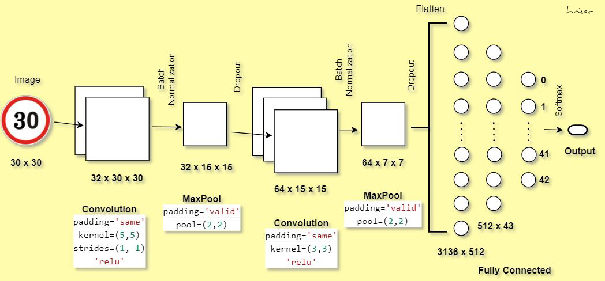

<h1 align="center"> <b> Hrisav's Portfolio </b> </h1>

  

[Project 1 : Stock Market Price Prediction](https://github.com/hrisav/stock-price-prediction)
--

* Predicting future values of stock using Time Series, ML, DL, NLP techniques.
* Time Series Analysis and Forecasting (Moving Avg, Exponential Smoothing, ARIMA, ARCH, GARCH, etc)
* Machine Learning Techniques (Both Classification and Regression)
* Deep Learning Techniques (Simple RNN, GRU, LSTM)
* Prediction using Sentiment Analysis (used VADER's Sentiment Intensity Analyser library)
* UI Building & Deployment using Amazon EC2.
* Various models were compared and following are their respective RMSE scores:

  

[Project 2 : Movie Recommendation System](https://github.com/hrisav/movie-recommendation)
--

* Genre based Movie Recommendation
* Recommending Movies using Pearson Correlation
* Recommending Movies using Cosine Similarity
* Recommending Movies using KNN (with Cosine distance metric)
* Clustering of movies (using KMeans)
* Recommending Movies using Content & Collaborative latent matrix with TFIDF & SVD
* Predicting unseen Movie ratings for user using Surprise Library (with SVD, KNN, NMF)
* Recommending Movies for a user using Surprise Library (with KNN)

  

[Project 3 : Traffic Sign Classification](https://github.com/hrisav/traffic-sign-classify)
--

* Created a model that will classify traffic sign images using Deep Learning and Machine Learning techniques.
* Problem has 43 traffic signs (classes) and 50000+ images in total.
* First a Convolutional Neural Network (Convolution >> Batch Normalization >> MaxPool >> Dropout) with fully connected layer (having 2 dense layers) was built which gave an accuracy of 97.11% on test data.
* The same Convolutional Neural Network's output was used to pass onto Random Forest and another model was built. It gave an accuracy of 95.64% on test data.

  

[Project 4 : Google Playstore Apps Rating Prediction](https://github.com/hrisav/playstore-app-rating-prediction)
--

* Created an app that will predict the ratings of new android apps.
* It will help the android developers to understand the factors behind the rating of any app.
* Data cleaning was done in the first step, followed by extensive EDA.
* Tried to understand univariate and bivariate analysis of the features.
* Analysis was done to understand how each of the categories of the app is performing.
* Performed various hypothesis tests.
* Applied OLS and tried to check autocorrelation and heteroscedasticity.
* Applied Random Forest Regressor, Linear Regression, Support Vector Regressor to select the final model.
* Random Forest Regressor gave best result with RMSE of 0.451.
* Built the UI using HTML, CSS, Flask. Deployment using Amazon EC2.

  

[Project 5 : Loan Approval](https://github.com/hrisav/loan-acceptance)
--

* Created an app that will predict if a customer is eligible for loan or not.
* Data cleaning was done to fill missing values with mean/median.
* Exploratory Analysis was performed to understand how other features are related to the target.
* Feature engineering was done and new feature Total Income was formulated.
* One Hot Encoding and Label Encoding was performed on Categorical features.
* Relevant features were selected and MinMaxScaler was applied.
* Applied Decision Tree, Random Forest, Gradient Boost, Logistic Regression to select the final model.
* Gradient Boosting model gave best performance with Recall of 53% and F1-Score of 60%.
* Built the UI using HTML, CSS, Flask. Deployment using Amazon EC2.

  

[Project 6 : Spam Classifier](https://github.com/hrisav/spam-ham)
--

* Built a binary classification model to detect whether a text message is spam or ham.
* Used NLP techniques like Lemmatization, Bag of Words, TFIDF as a baseline for ML model building.
* Machine Learning models were built using Naive Bayes, KNeighborsClassifier, DecisionTreeClassifier, SVM Classifier.
* For Deep Learning, techniques like Tokenizing, Word Indexing, Sequencing, Padding were followed.
* It was then passed through either the Dense network or LSTM network.
* Among ML models, SVM Classifier using TFIDF gave best result (precision of 100% and F1 score of 92%).
* Among DL models, Dense network performed better in terms of validation loss and accuracy.

**ML structure:**

  

**DL structure:**

  

[Project 7 : Customer Segmentation for RFM analysis](https://github.com/hrisav/Customer-Segmentation)
--

* Understanding a retail store's customer purchase data having 51,243 transactions.
* Generating Recency, Frequency, Amount features for RFM analysis.
* Built a 4-segment solution (using K-Means clustering).
* Building segments from the managerial implementation angle.
* Suggesting marketing and promotional activities based on segments.

  

[Project 8 : Marketing Mix Modeling](https://github.com/hrisav/FMCG-regression)
--

* Understanding dataset having: Price of Brand X, Feature (value-added variant is present or not), Display (if any promo is present) and its competitor's prices.
* Perform OLS Regression using all features.
* Check significance of features (by P-value) and drop insignificant ones and do OLS again.
* Try feature engineering and check interaction effect between variables and make new features.
* Check adjusted R score and mean absolute error.
* Perform model building using DecisionTreeRegressor, RandomForestRegressor, KNeighborsRegressor.
* Also perform hyperparameter tuning and apply crossvalidation for best result.
* Achieved R2 score of 70% using Random Forest (with interaction effect)

  

[Project 9 : Loan Approval using Spark](https://github.com/hrisav/loan-eligibility-spark)
--

* To predict if a customer is eligible for loan or not.
* Understanding the problem and setting up Spark environment.
* Data cleaning was done and EDA was performed to understand how other features are related to the target.
* Feature engineering was done and new feature Total Income and EMI was formulated.
* String Indexing and One Hot Encoding were performed on Categorical features.
* Using Vector Assembler multiple columns were merged into a vector column.
* Applied Decision Tree Classifier, Random Forest Classifier, Logistic Regression to select the final model.
* Model which gave best performance with high Recall and F1-Score was opted.

  

[Project 10 : Super Store Sales Dashboard](https://github.com/hrisav/tableau-works/tree/main/super-store-sales)
--

* Making a store sales dashboard using Tableau.
* Trying to understand key performing areas and areas which hasn't performed well.
* Understanding how Sales, Profit and Discount varied across Categories, Sub-categories, Regions.
* Graphs used - Scatter plot, Box plot, Butterfly chart, Bump chart, Bar Charts, Maps, Bubbles, etc.

  

  

